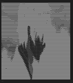

# Ascii ART 

Convert any image into ASCII Art. and made it accessible to transfer by creating a new file for it.
# Convert Images into ASCII Art with the power of Python


## Contents
- [What ASCIIFY is](#what-asciify-is)
- [How ASCIIFY works](#how-asciify-works)
- [How to use ASCIIFY](#how-to-use-asciify)
- [Future Plans](#future-plans)
- [Support me](#support-me)

## What ASCIIFY is
ASCIIFY is a python script that takes in as input an image, and returns a text output that resembles the input image.
In other words, it replicates an image with certain characters.

For example, when the following image of boy - 
is passed as a parameter into ASCIIFY, the following output is observed -

BEFORE


AFTER

```
###########################@@@@#@#@@@@@@@@@@@@@@@@@@@@@@@@@@@@@@@@@@################################
##########################@@@@@@@@@@@@@@@@@@@@@@@@@@@@@@@@@@@@@@@@@@@###############################
###@#####################@@@@@@@@@@@@@@@@@@@@@@@@@@@@@@@@@@@@@@@@@@@@@################$$$$##########
###@#####################@@@@@@@@@@@@@#@@@@@@@@@@@@@@@@@@@@@@@@@@@@@@@@@#############$$$$$$#########
#########################@@@@@@@@@@@@@@@@@@@@@#$@@@@@@@@@@@@@@@@@@@@@@@@@###########$$$$$$$#########
########################@@@@@@@@@@@@@@@@@@@@@@@#@@@@@@@@@@@@@@@@@@@@@@@########$$#$$$$$$$###########
$$$#####################@@@@@@@@@@@@@@@@@@@@@@@@@@@@@@@@@@@@@#@#@@###@#@#####$$$$$$$$$$$############
$$$$$###################@@@@@@@@@@@@@@@@@@@@@@@@@@@@@@#@#@@@@#@@#@####@#@#####$$$#$$################
$$$$$$$$$############$##@@@@@@@@@#@@@@@@@@@@@@@@@@@@@@#@#@@@@@@@@@@@@@@######################$######
$$$$$$$$$$$$$$$$$$$$$$$$@@@@@@@@@#@@@@@@@@@@@@@@@@@@@@@@@@@@@@@@@@@@@@@####################$$$######
#########$$$$$$$$$$$$$$$@@@@@@@@@@@@@@@@@@@@@@@@@@@@@@@@@@@@@@@@@@@@@@@####################$$$######
############$$$$$$$$$$$$@@@@@@@@@@@@@@@@@@@@@@@@@@@@@@@@@@@@@@@@@@@@@@@@####$$$$$$$$$#######$#######
##############$$$$$$$$$$@@@@@@@@@@@@@@@@@@@@@@@@@@@@@@@@@@@@@@@@@@#@@@@@###$$$$$$$$$$$$##$##$######$
###################$$$$#@@@@@@@@@@@@@@@@@@@@@@@@@@@@@@@@@@@@@@@@@@@@@@@@##$$$$$$$$$$$$$$$$$$#$$###$$
###################$####@@@@@@@@@@@@@@@@@@@@@@@@@@@@@@@@@@@@@@@@@#@@@@@@##$$$$%$$$$$$$$$$$$$$$$$$$$$
###################$####@@@@@@@@@@@@@@@@@@@@@@@@@@@@@@@@@@@@@@@@@@@@@@@@@#$$$$%$$$$$$$$%%%%$$$$$$$$%
########################@@@@@@@@@@@@@@@#@@@@@@@@@@@@@@@@@@@@@@@@@@@@@@@@@@####$$$$%$$%%%%%%$$$$$$$$%
#######################@@@@@@@@@@@@@@@?,:%@@@@@@@@@@@@@@@@@@@@@@@@@@@@@@@@@@@#$$$$%%%%$$$$$$$$$$$$%%
#######################@@@@@@@@@@@@@@@+:,+@@@@@@#@@@@@@@@@@@@@@@@@@@@@@@@@@@@@#$$$$%%$##@@#####$$$%?
######################@@@@@@@@@@@@@@@@;;;*@@@@@@#@@@@@@@@@@@@@@@@@@@@@@@@@@@@@@#$$$$$##@@@@@####$$%?
######################@@@@@@@@@@@@@@@@;,;?@@@@@##@@@@@@@@@@@@@@@@@@@@@@@@@@@@@@#$$$$$#@@@@@@@@@@#$%?
########################@@@@@@@@@@@@@@+,;*@@@@@#@@$#@@@@@@@@@@@@@@@@@@@@@@@@@@@#######@@@@@@@@@@#$%?
#########################@@@@@@@@@@@@@?,.;@@@@@#@@*@@@@@@@@@#@@@@@@@@@@@@@@@@@@@@@@@@@@@@@@@@@@@@##%
#########################@@@@@@@@@@@@@$.,+#@@@@@@$*@@#@@@@@@*@@@@@@@@@@@@@@@@@@@@@@@@@@@@@@@@@@@@@#$
#########################@@@@@@@@@@@@@#,+*+#@@@@@*%@%%%@@@@$+@@@@@@@@@@@@@@@@@@@@@@@@@@@@@@@@@@@@@@#
$########$$##############@@@@@@@@@@@@@$:;;,%@@@@#+#?+%:#@@@++@@@@@@@@@@@@@@@@@@@@@@@@@@@@@@@@@@@@@@@
$$$$$$$$$$$$$$$$##########@@@@@@@@@@@@*;,+,;@@@@$**;?:.%$@?,%@@@@@@@@@@@@@@@@@@@@@@@@@@@@@@@@@@@@@@@
%%%%%$$$%%%%$$$$$######$$#@@@@@@@@@@@@+;;,.,*%@@?;;::..+%#?,$@@@@@@@@@@@@@@@@@@@@@@@@@@@@@@@@@@@@@@@
%%%%%%%%%%%%%%%$$$$$###$$$@@@@@@#?@@@$;;+:..,:$@$,,,...:*?%+?@@@@@@@@@@@@@@@@@@@@@@@@@@@@@@@@@@@@@@@
?%%%%%%%%%%%%%%%%$$$$$$$$$#@#$@@*+@@$?;;+,...,;$#,.,..,,;;:;#@+%@@@@@@@@@@@@@@@@@@@@@@@@@@@@@@@@@@@@
??%%%%%%$$$$$%$$%%%%%%$$$%#$*;$#,,#@%*;;+,...,:;$;.,....,,,?$+.;@@@@@@@@@@@@@@@@@@@@@@@@@@@@@@@@@@@@
*??%%%%%%$$$%%%%%%%%%%###;?::.;#,.%@*;;;+,...,,:;:,,....,,,:,..:@@@@@@@@@@@@@@@@@@@@@@@@@@@@@@@@@@@@
??%$$%%%%%%??????????#@@?.:.,..?;.;#+;;;+:.....:,.,,.....,,.,:;$@@@@@@@@@@@@@@@@@@@@@@@@@@@@@@@@@@@@
%%$###$%%????*******%@@@;.,:,..,;.,?;;;;+;,....,,.,,.....,,.:*#@@@@@@@@@@@@@@@@@@@@@@@@@@@@@@@@@@@@@
$$#@@@@#$%%????*****#@@@+,.,:,..,,.,:;;;;;:.......,......,,.+@@@@@@@@@@@@@@@@@@@@@@@@@@@@@@@@@@@@@@@
##@@@@@@#$%%%%%????%@@@@#;..,:,,,....:;;;;;:,.....,....,,,,:$@@@@@@@@@@@@@@@@@@@@@@@@@@@@@@@@@@@@@@@
@@@@@@@@#$$$$$$%%%%#@@@@@#:.,.::.....,;;;;;;:,....,....,,.?@@@@@@@@@@@@@@@@@@@@@@@@@@@@@@@@@@@@@@@@@
@@@@@@@@#$$$$$$$$$$@@@@@@@$:...,:,....:;;;;;;:,...,,....,*@@@@@@@@@@@@@@@@@@@@@@@@@@@@@@@@@@@@@@@@@@
#@@@@@@@@#$$$$$$%%#@@@@@@@@#;...,:,...,;;;;;;;;,..,,..,:$@@@@@@@@@@@@@@@@@@@@@@@@@@@@@@@@@@@@@@@@@@@
##@@@@@@@##$##%%%#@@@@@@@@@@@+...,:,..,;;;;;;+%+,.,,...;@@@@@@@@@@@@@@@@@@@@@@@@@@@@@@@@@@@@@@@@@@@@
@@@@@@@@@@@@@#%?$@@@@@@@@@@@@@*....,:,,;;;;;;;$#%;.....*@@@@@@@@@@@@@@@@@@@@@@@@@@@@@@@@@@@@@@@@@@@@
@@@@@@@@@@@@@#$%@@@@@@@@@@@@@@@*....,:,;+;;;;;%@@$?;,,,$@@@@@@@@@@@@@@@@@@@@@@@@@@@@@@@@@@@@@@@@@@@@
@@@@@@@@@@@@@@#@@@@@@@@@@@@@@@@@+....,:;+;;;;;#@@@@@$%?@@@@@@@@@@@@@@@@@@@@@@@@@@@@@@@@@@@@@@@@@@@@@
@@@@@@@@@@@@@@@@@@@@@@@@@@@@@@@@@;....,+*;;;;%@@@@@@@$#@@@@@@@@@@@@@@@@@@@@@@@@@@@@@@@@@@@@@@@@@@@@@
@@@@@@@@@@@@@@@@@@@@@@@@@@@@@@@@@#;....;*+;;%@@@@@@@@@@@@@@@@@@@@@@@@@@@@@@@@@@@@@@@@@@@@@@@@@@@@@@@
@@@@@@@@@@@@@@@@@@@@@@@@@@@@@@@@@@#:...;**++#@@@@@@@@@@@@@@@@@@@@@@@@@@@@@@@@@@@@@@@@@@@@@@@@@@@@@@@
@@@@@@@@@@@@@@@@@@@@@@@@@@@@@@@@@@@$,..:****?@@@@@@@@@@@@@@@@@@@@@@@@@@@@@@@@@@@@@@@@@@@@@@@@@@@@@@@
@@@@@@##@@@@@@@@@@@@@@@@@@@@@@@@@@@@%,.,*****%@@@@@@@@@@@@@@@@@@@@@@@@@@@@@@@@@@@@@@@@@@@@@@@@@@@@@@
@@@@@@@@@@@@@@@@@@@@@@@@@@@@@@@@@@@@@*..;****?@@@@@@@@@@@@@@@@@@@@@@@@@@@@@@@@@@@@@@@@@@@@@@@@@@@@@@
@@@@@@@@@@@@@@@@@@@@@@@@@@@@@@@@@@@@@@+.:****?@@@@@@@@@@@@@@@@@@@@@@@@@@@@@@@@@@@@@@@@@@@@@@@@@@@@@@
@@@@@@@@@@@@@@@@@@@@@@@@@@@@@@@@@@@@@@@;.;***%@@@@@@@@@@@@@@@@@@@@@@@@@@@@@@@@@@@@@@@@@@@@@@@@@@@@@@
@@@@@@@@@@@@@@@@@@@@@@@@@@@@@@@@@@@@@@@#,,+**#@@@@@@@@@@@@@@@@@@@@@@@@@@@@@@@@@@@@@@@@@@@@@@@@@@@@@@
@@@@@@@@@@@@@@@@@@@@@@@@@@@@@@@@@@@@@@@@%.,+?@@@@@@@@@@@@@@@@@@@@@@@@@@@@@@@@@@@@@@@@@@@@@@@@@@@@@@@
@@@@@@@@@@@@@@@@@@@@@@@@@@@@@@@@@@@@@@@@@+.,?@@@@@@@@@@@@@@@@@@@@@@@@@@@@@@@@@@@@@@@@@@@@@@@@@@@@@@@
@@@@@@@@@@@@@@@@@@@@@@@@@@@@@@@@@@@@@@@@@#:.?@@@@@@@@@@@@@@@@@@@@@@@@@@@@@@@@@@@@@@@@@@@@@@@@@@@@@@@
@@@@@@@@@@@@@@@@@@@@@@@@@@@@@@@@@@@@@@@@@@?.$@@@@@@@@@@@@@@@@@@@@@@@@@@@@@@@@@@@@@@@@@@@@@@@@@@@@@@@

```

## How ASCIIFY works
ASCIIFY works in a rather simple and intuitive way.
Here's the algorithm -
- Resize the image to a standard dimension, while maintaining aspect ratio
- Convert to grayscale (the reason for doing so is because characters are replaced based on their intensity)
- Create list of special characters to replace pixels with
- Classify and divide pixels into buckets or groups, based on their intensity
- Replace all pixels in a bucket with the corresponding special character
- Print the text into terminal or write into a file
- Profit!

-------------------------------------------------------------------------------------------------------
## How to use ASCIIFY
- Ensure you have the required dependency "PIL" for Python installed. (pip install pillow)
- Clone the repo
- Run the python script, and pass the image path as the parameter
- The script will print the output in the terminal, and will also write into a file 'img.txt' in the same directory as the python script
- Profit!

-------------------------------------------------------------------------------------------------------
## Future Plans
- Alternatively support colored outputs by printing the text onto an image

-------------------------------------------------------------------------------------------------------
## Support Me
If you liked this, leave a star! :star:

If you liked this and also liked my other work, be sure to follow me for more! :slightly_smiling_face:


### Module used
python modules
```
import PIL.Image
```

## PRE-REQUISITES
Your laptop with 3.6.x (onwards) installed.

**NOTE:** Those with Linux and MacOSX would have Python installed by default, no action required.

Windows: Download the version for your laptop via https://www.python.org/downloads/

**NOTES**
In your preferred editor, make sure indentation is set to "4 spaces".

* Make sure you have **pygame** installed in python otherwise code may fail, to install pygame in your machine > open python in your terminal then type `pip install pygame` to install. :warning:

---

## Run using Python3.8+
1. Clone or download repositiory: https://github.com/arevish/asciiart.git
2. In source folder, run `python3 'asciiart.py'` to start program, optionally, run with `--help` argument to see other runtime options.



### Thankyou!
